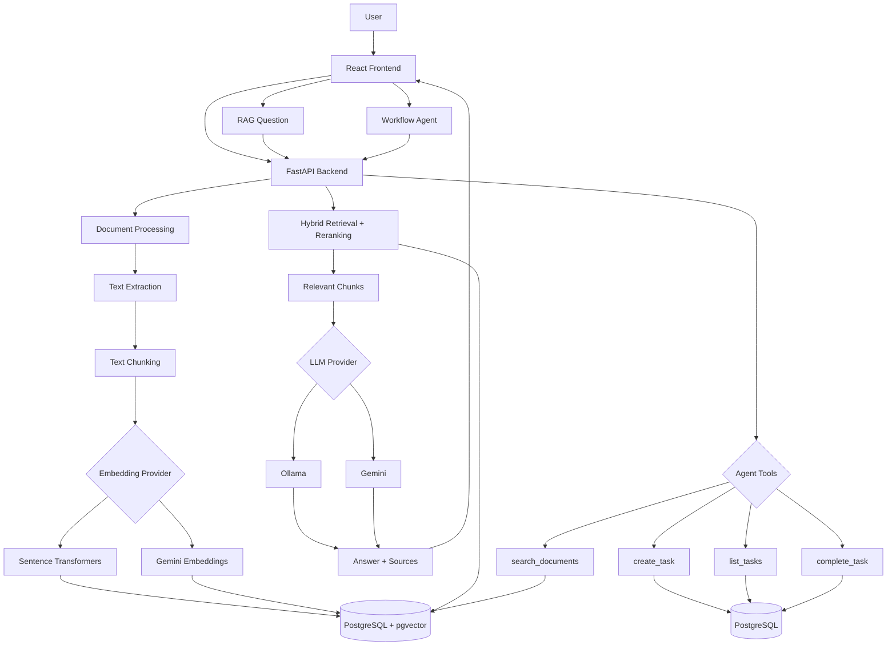
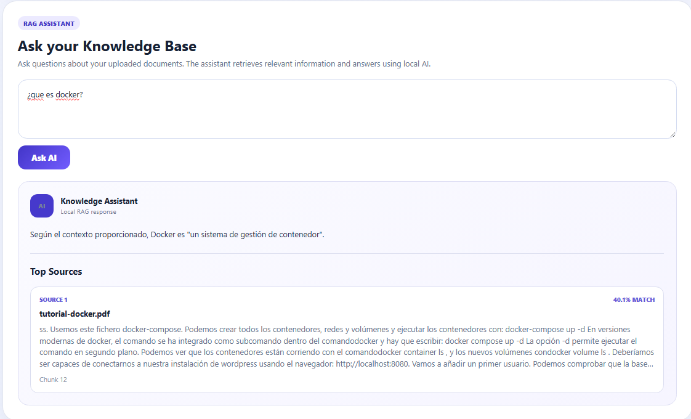
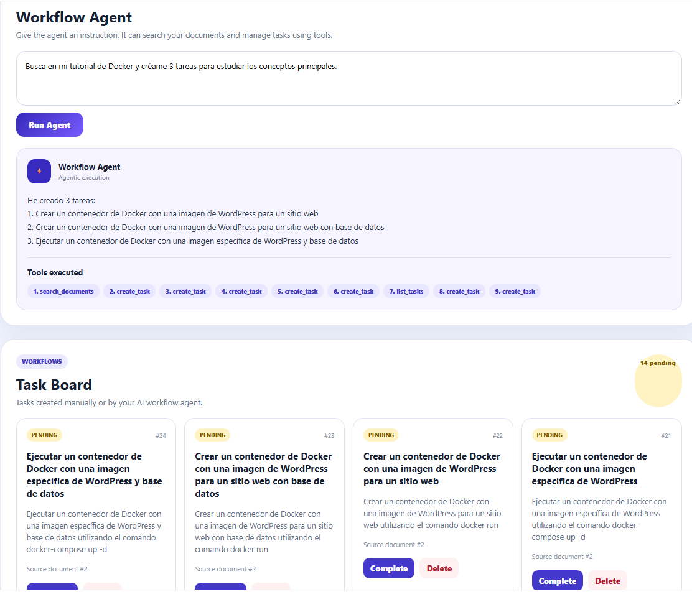
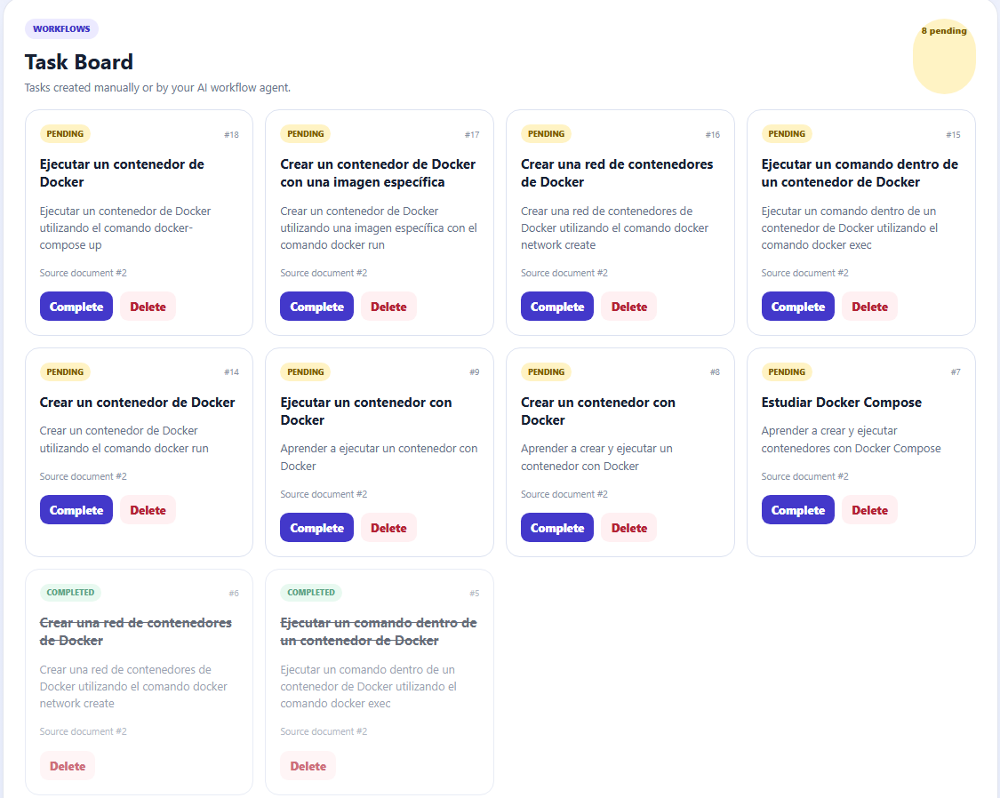
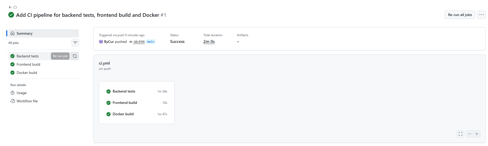

# AI Knowledge & Workflow Assistant

A full-stack AI application that combines document knowledge retrieval, Retrieval-Augmented Generation (RAG), semantic search and agentic workflows.

Users can upload documents, ask questions about their content and instruct an AI agent to search the knowledge base and execute actions such as creating and managing tasks.

The project supports two AI execution modes: a local stack with Ollama and Sentence Transformers, and a cloud stack using Gemini for generation and embeddings with Neon PostgreSQL + pgvector.

---

[](https://github.com/ByCur/ai-knowledge-workflow-assistant/actions/workflows/ci.yml)

**Application:** [Open the live demo](https://ai-knowledge-frontend.onrender.com)

**API Documentation:** [FastAPI Swagger](https://ai-knowledge-workflow-assistant.onrender.com/docs)

> The backend runs on Render's free tier and may take around one minute to wake up after a period of inactivity.

## Features

### Document Knowledge Base

- Upload PDF and TXT documents
- Drag & drop document upload
- Automatic text extraction
- Automatic document indexing
- Persistent document storage
- Delete documents from the interface
- Document processing status

### RAG Pipeline

- Automatic text chunking
- Local Sentence Transformers or Gemini embeddings
- PostgreSQL vector storage with pgvector
- Semantic similarity search
- Retrieval of the most relevant document chunks
- Gemini cloud inference or local Ollama inference
- Source-aware answers
- Top relevant sources displayed with similarity scores

### AI Workflow Agent

The application also includes an AI agent capable of using tools and modifying application state.

Available tools:

- `search_documents`
- `create_task`
- `list_tasks`
- `complete_task`

Example instruction:

> Busca en mi tutorial de Docker y créame 3 tareas para estudiar los conceptos principales.

The agent can autonomously execute a multi-step workflow:

```text
User instruction
      ↓
AI Agent
      ↓
search_documents
      ↓
Retrieve relevant document chunks
      ↓
create_task
      ↓
create_task
      ↓
create_task
      ↓
Tasks stored in PostgreSQL
```

The frontend displays the tools executed by the agent so its actions remain visible to the user.

### Task Management

- AI-generated tasks
- Manual task management API
- Pending/completed states
- Complete tasks
- Delete tasks
- Link tasks to source documents
- Protection against duplicate pending tasks
- Agent guardrails preventing unauthorized task completion

### Engineering & Quality

- Dockerized frontend, backend and database
- PostgreSQL + pgvector
- Automated backend tests with pytest
- Production frontend build validation
- GitHub Actions continuous integration
- Docker Compose validation
- Multi-step agent execution safeguards

---

## Architecture



---

## RAG Pipeline

The retrieval-augmented generation pipeline works as follows:

```text
Document
    ↓
Text extraction
    ↓
Chunking
    ↓
Sentence Transformers / Gemini embeddings
    ↓
pgvector
    ↓
Vector search + hybrid reranking
    ↓
Top relevant chunks
    ↓
Ollama / Gemini
    ↓
Grounded answer + sources
```

The application supports interchangeable embedding providers.

For local development it can use:

```text
sentence-transformers/paraphrase-multilingual-MiniLM-L12-v2
```

For the public cloud deployment it uses Gemini embeddings.

Embeddings use 384 dimensions and are stored directly in PostgreSQL using pgvector. Local and cloud embeddings are kept in a consistent vector space per deployment and are not mixed.

Language-model generation is also provider-based:

- **Local:** Ollama with `llama3.2:3b`
- **Cloud:** Gemini

This makes it possible to develop locally without external AI dependencies while keeping the public demo lightweight enough for cloud hosting.

---

## Agentic Workflow

The workflow agent uses a tool-based architecture.

Instead of only generating text, the model can decide that an application action is required.

For example:

```text
"Create 3 study tasks from my Docker tutorial"
```

may produce:

```text
1. search_documents
2. create_task
3. create_task
4. create_task
```

Every tool execution is performed by the backend rather than directly by the language model.

The backend applies guardrails before executing sensitive actions.

For example, the model cannot mark a task as completed unless the user's instruction explicitly requests completion.

This separates:

```text
LLM decision
     ↓
Application policy
     ↓
Tool execution
```

and prevents the model from having unrestricted control over application state.

---

## Technology Stack

### Frontend

- React
- TypeScript
- Vite
- CSS

### Backend

- Python
- FastAPI
- SQLAlchemy
- Pydantic
- HTTPX

### AI / RAG

- Gemini
- Ollama
- Llama 3.2
- Sentence Transformers
- Multilingual MiniLM embeddings
- pgvector
- Hybrid retrieval and reranking
- Semantic search
- Retrieval-Augmented Generation

### Data

- PostgreSQL
- pgvector

### DevOps & Cloud

- Docker
- Docker Compose
- GitHub Actions
- pytest
- Render
- Neon

---

## Project Structure

```text
ai-knowledge-workflow-assistant/
│
├── .github/
│   └── workflows/
│       └── ci.yml
│
├── backend/
│   ├── app/
│   │   ├── agent_service.py
│   │   ├── agent_tools.py
│   │   ├── chunking_service.py
│   │   ├── config.py
│   │   ├── database.py
│   │   ├── embedding_service.py
│   │   ├── llm_service.py
│   │   ├── main.py
│   │   ├── models.py
│   │   ├── rag_service.py
│   │   ├── retrieval_service.py
│   │   └── schemas.py
│   │
│   ├── tests/
│   │   ├── test_agent_logic.py
│   │   └── test_chunking.py
│   │
│   ├── Dockerfile
│   ├── pytest.ini
│   └── requirements.txt
│
├── frontend/
│   ├── src/
│   │   ├── App.tsx
│   │   └── App.css
│   │
│   ├── Dockerfile
│   └── package.json
│
├── docs/
│   └── screenshots/
│
├── docker-compose.yml
└── README.md
```

---

## Running Locally

### Requirements

Install:

- Docker Desktop
- Git
- Ollama

Clone the repository:

```bash
git clone <repository-url>
cd ai-knowledge-workflow-assistant
```

Download the local LLM:

```bash
ollama pull llama3.2:3b
```

Make sure Ollama is running.

Then start the application:

```bash
docker compose up --build
```

Open:

### Frontend

```text
http://localhost:5173
```

### FastAPI documentation

```text
http://localhost:8000/docs
```

### Backend health check

```text
http://localhost:8000/health
```

---

## Example Workflow

1. Upload a Docker tutorial PDF.
2. The backend extracts the document text.
3. The document is divided into chunks.
4. Local embeddings are generated.
5. Embeddings are stored in pgvector.
6. Ask:

```text
¿Qué es Docker?
```

7. The RAG assistant retrieves relevant chunks and generates an answer with sources.

Then give the workflow agent an instruction:

```text
Busca en mi tutorial de Docker y créame 3 tareas
para estudiar los conceptos principales.
```

The agent searches the document and creates real tasks in PostgreSQL.

---

## Testing

Run the backend test suite:

```bash
docker compose run --rm backend pytest -v
```

Current tests cover:

- text chunking
- empty-document handling
- requested task-count detection
- explicit task-completion intent
- protection against accidental task completion

---

## Continuous Integration

GitHub Actions runs automatically on pushes and pull requests to `main`.

The CI pipeline validates:

```text
Backend tests
Frontend production build
Docker application build
```

This ensures changes cannot silently break the backend, TypeScript frontend or Docker configuration.

---

## Screenshots

### RAG Assistant



### Workflow Agent



### Task Board



### Continuous Integration



---

## Key Engineering Concepts Demonstrated

This project demonstrates practical experience with:

- Full-stack application architecture
- REST API design
- PostgreSQL persistence
- Vector databases
- Semantic search
- Retrieval-Augmented Generation
- Cloud and local language-model providers
- Embedding models
- AI tool use
- Agentic workflows
- LLM guardrails
- Multi-step AI execution
- Dockerized development
- Automated testing
- Continuous integration

---

## Future Improvements

Possible future extensions include:

- semantic duplicate detection for tasks
- conversational RAG history
- document-specific filtering
- streaming LLM responses
- authentication and multiple users
- background document processing
- improved retrieval and reranking
- agent execution history

---

## Author

Developed as a full-stack AI engineering portfolio project focused on RAG, cloud/local AI integration and agentic workflow automation.